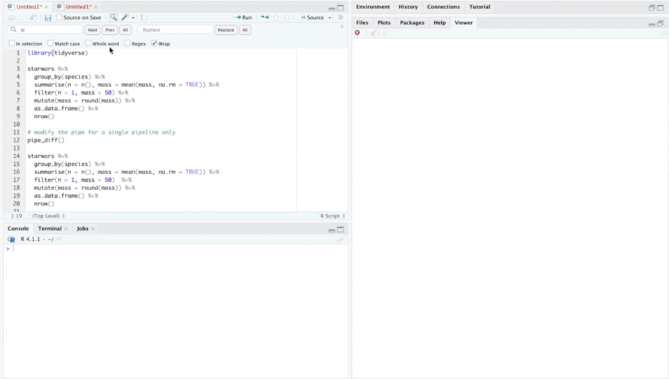

<!-- README.md is generated from README.Rmd. Please edit that file -->

# pipediff

Show diff between piped steps

## Installation

Install with:

``` r
remotes::install_github("moodymudskipper/pipediff")
```

## Example

``` r
library(dplyr, warn = FALSE)
library(pipediff)
pipediff()
starwars %>%
  group_by(species) %>%
  summarise(n = n(), mass = mean(mass, na.rm = TRUE)) %>%
  filter(n > 1, mass > 50)  %>%
  mutate(mass = round(mass)) %>%
  as.data.frame() %>%
  nrow()
```


